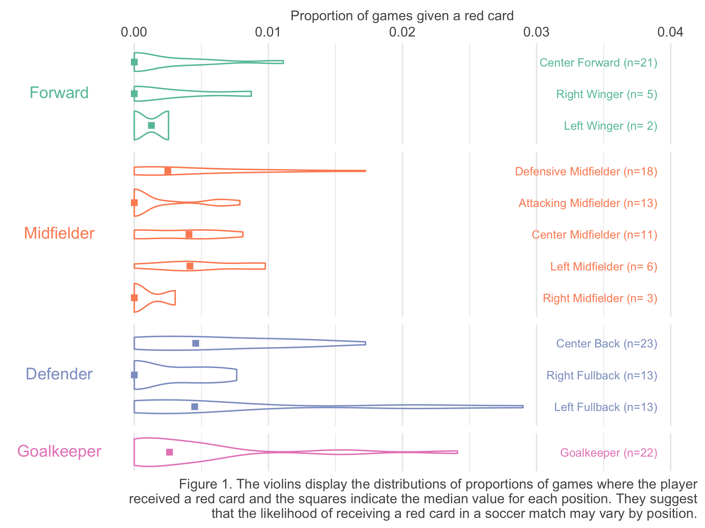

## Multiverse analysis in R

Suppose you want to taken each player's position information into account in building the model. As seen in Figure 1, defensive players were more prone to receiving a red card in a match. Controlling for a player's position thus seems like a reasonable choice.

```{r multiverse-tut-position-plot, out.width="80%"}

```

Note that the data set provides _typical position_ each player played _as of June 2014_ when Silberzahn et al. (2018) collected them. However, the red card and game counts may represent an accumulation over multiple years depending on the player's career. During these years, a player may have played multiple positions. This leads to a disconnect between the position information and the red cards on record. For example, a center back as of June 2014 may have received a red card while playing as a right full back. 

To address the issue, one may consider grouping the positions assuming that most players do not switch between the groupings over their careers. Figure 1 shows a common grouping of the positions<sup><a href="#note3">3</a></sup>. We may also consider grouping all positions on the field and only keep _Goalkeeper_ as a separate position. Or, we may even decide not to use the position information deeming the information as unreliable. 

We can argue that all four options below provide _defensible_ analysis paths.

+   Use position variable as is
+   Group positions into the common 4-tie groups as shown in Figure 1
+   Group positions into fielders vs. goalkeeper
+   Do not use position information

### Multiverse analysis in R

We will demonstrate a multiverse analysis across the four defensible analysis paths, or analysis universes in R. We will use the `tidyverse` package for data manipulation.

```{r tidy-tut-init, echo=TRUE, message=FALSE, eval=FALSE}
library(tidyverse)
```

### Specifying options at decision points

We will start by creating columns that correspond to the alternative groupings for players' positions. We will name these grouped position columns as `position_common` for the common grouping in Figure 1 and `position_fld_vs_gk` for the fielder vs goalkeeper grouping.

```{r tidy-tut-branch, echo=TRUE, eval=FALSE}
soccer <- soccer %>%
  mutate(
    position_common = forcats::fct_collapse( 
      # forcats::fct_collapse() is a convenient helper function for regrouping factors
      position, 
      Forward = c("Center Forward", "Right Winger", "Left Winger"), 
      Midfielder = c("Defensive Midfielder", "Attacking Midfielder", 
                     "Right Midfielder", "Center Midfielder", "Left Midfielder"), 
      Defender = c("Center Back", "Right Fullback", "Left Fullback"), 
      Goalkeeper = c("Goalkeeper")), # groups position into 4 groups
    position_fld_vs_gk = if_else(position == "Goalkeeper", "Goalkeeper", "Fielder") # group all fielders
  )
```

We will then use `formula()` to specify the four model specifications. This effectively specifies the four universes for the multiverse analysis.

```{r tidy-tut-formula, echo=TRUE, eval=FALSE}
model_1 <- formula(cbind(redCards, games - redCards) ~ skintone + position)
model_2 <- formula(cbind(redCards, games - redCards) ~ skintone + position_common)
model_3 <- formula(cbind(redCards, games - redCards) ~ skintone + position_fld_vs_gk)
model_4 <- formula(cbind(redCards, games - redCards) ~ skintone)
```


### Fitting models across the multiverse

We will now call `glm()` for each model specified. To minimize redundancy in codes, we will place the four `formula` objects in a list and use vectorized calls. 

```{r tidy-tut-glm, echo=TRUE, eval=FALSE}
models <- list(model_1, model_2, model_3, model_4)
multiverse_fit <- lapply(models, function(x) {
  glm(x, family = binomial(link = "logit"), data = soccer)
}) # lapply applies the function(m) {...} to each member of the models list
```

The result is a list of fitted `glm` object. You can access each by index. For example, the following code displays the estiamted coefficients from the fourth universe. As expected, it displays the same result as the result of the model fitted in _Logistic regression analysis in R_ section.

```{r tidy-tut-glm-list, echo=TRUE, eval=FALSE}
summary(multiverse_fit[[4]])$coef
```

```{r tidy-tut-glm-list-disp}
load("03-multiverse-analysis.RData")
summary(multiverse_fit[[4]])$coef %>% as.data.frame()
```

### Results

We can use the `lapply()` strategy again for extracting the coefficients from each fitted results knowing `multiverse_fit` is a list of fitted objects. Inside the function we will call `broom::tidy()` with `exponentiate = TRUE, conf.int = TRUE, conf.level = .95` as before to extract the estimates and 95% confidence intervals in odd scale. We will focus our attention to the variable interest `skintone` by filtering the result. The resulting object is again a list. To merge the results to a single data frame, we can use `bind_rows()`.

```{r tidy-tut-glm-res, echo=TRUE, eval=FALSE}
multires <- lapply(multiverse_fit, function(x) {
  broom::tidy(x, exponentiate = TRUE, conf.int = TRUE, conf.level = .95) %>%
    filter(term == "skintone") # filter for skintone
})
bind_rows(multires) # join the results
```

```{r tidy-tut-glm-res-save}
multiverse_res
```

From the table above, we observe that the results are consistent in direction and statistical significance at 95% confidence level across the multiverse of analysis paths. The results indicate that players with very dark skin tones suffer approximately `r sprintf("%.1f%%", min(multiverse_res$estimate) * 100 - 100)`~`r sprintf("%.1f%%", max(multiverse_res$estimate) * 100 - 100)` (Odd ratio 95% CIs ranging approximately within [`r sprintf("%.2f", min(multiverse_res$conf.low))`, `r sprintf("%.2f", max(multiverse_res$conf.high))`]) higher odds of getting a red card during match compared to their colleagues with very light skin tones. 

```{=html}
<hr />
<footnote id="note3"><sup><a href="#note3">3</a></sup>We referred to <a href="https://yoursoccerhome.com/soccer-positions-a-complete-and-easy-to-understand-guide/" target="_blank">this guide</a> for the groupings.</footnote>
<br /><footnote id="note4"><sup><a href="#note4">4</a></sup><coce>filter_branch()</code> and <code>add_filter_branch()</code> are also available that multiplexes <code>filter()</code> in tidyverse.</footnote>
```
